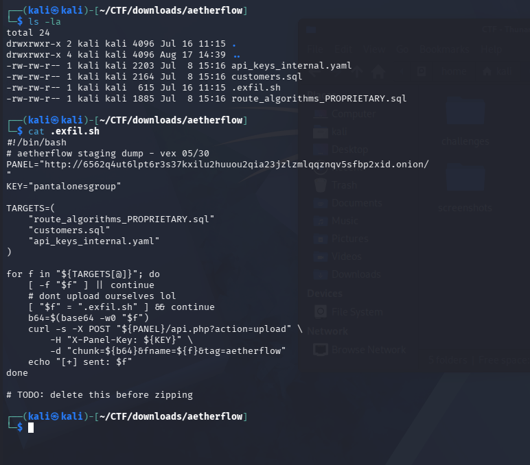
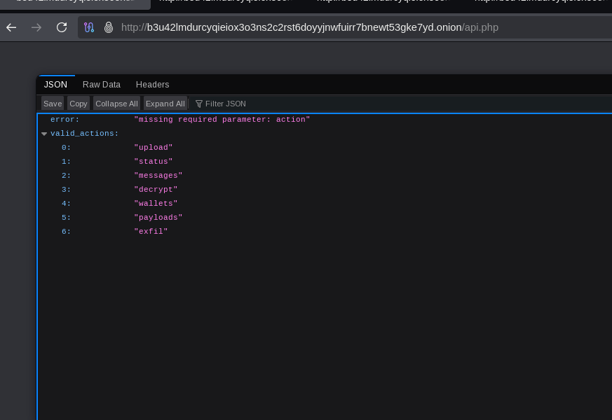
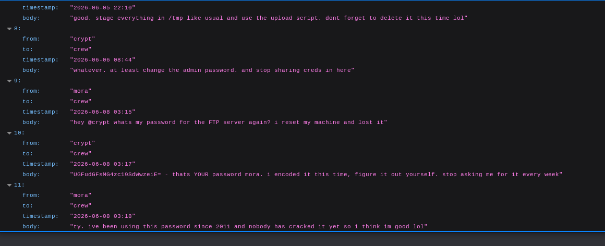

# Sisterhood of the Travelling Packets
**Ransomware Infrastructure Investigation | CTF Write-Up**

> **Authorization:** This write-up documents activities performed within an authorized Capture the Flag (CTF) environment. All systems, accounts, credentials, and infrastructure referenced were part of the challenge. 

## Overview

The Sisterhood of the Traveling Packets CTF centered on investigating the Tor-hosted infrastructure of a fictional ransomware group and identifying operational security failures that could be used to gain access to protected portions of their environment. 

I approached this challenge (as most others) as an investigation, rather than simply documenting the shortest path to the flag. This write-up includes the evidence I followed, hypotheses I tested, a few dead ends, and the reasoning behind each pivot. 

The investigation ultimately involved analyzing exposed victim data, discovering an accidentally leaked exfiltration script, enumerating web resources and API endpoints, accessing improperly protected internal communications, and recovering credentials for a known user account. 

# Investigation Environment 

* **Operating System:** Kali Linux
* **Network Access:** Tor
* **Techniques:** Source code inspection, artifact analysis, web enumeration, API enumeration, account enumeration, Base64 decoding, shell-script analysis, and cross-artifact correlation.

# Investigation Path

Tor Site → Page Source Inspection → Exposed Victim Downloads → Victim Data Analysis → Hidden .exfil.sh Artifact → Web Enumeration → robots.txt → /admin.php + /api.php → Account & API Enumeration → Internal Message Disclosure → Encoded Credential Discovery → Credential Decoding → Administrative Access → Flag

## 1. Initial Reconnaissance

I began by manually exploring the ransomware group's Tor-hosted website and reviewing the page source for information that was not visible through the normal interface. One of the first things that stood out was a suspicious Base64-encoded string. I decoded the value to determine whether it was the flag or contained hidden information, but it was a decoy flag that encouraged you to keep looking. 

Continuing through the source, however, revealed something much more interesting. Direct references to downloadable data belonging to two victim organizations.  

``` /downloads/quantumcore ```
``` /downloads/quantumcore/quantumcore_leak.zip ```  

``` /downloads/aetherflow ``` 
``` /downloads/aetherflow/aetherflow_leak.zip ```

The exposed paths provided access to leaked data belonging to QuantumCore Systems and AetherFlow Enterprises, giving me the next place to investigate. 

## 2. Victim Data Analysis

I downloaded and extracted the QuantumCore and AetherFlow archives and began reviewing their contents for anything that might provide more information about the victims, the ransomware group, or how the compromises occurred.   

While comparing the data from both organizations, one name stood out: ``` i.mccarthy ```. The same user appeared in data belonging to both Quantumcore and Aetherflow. Since the datasets came from two separate victim organizations, the overlap seemed quite suspicious. I investigated the account further to determine wehter it could represent a connection between the victims or the threat actors.  

It turned out to be a dead end.  

Still, it was a reasonable lead based on the evidence available at the time. With nothing else to connect ``` i.mccarthy ``` to the investigation, I returned to examining the downloaded files for anything I may have missed. 

## 3. Hidden Exfiltration Script

While examining the extracted AetherFlow files from the command line, I ran ``` ls -la ```. Using ``` -a ``` revealed a hidden file that wasn't initially visible in the directory listing: ``` .exfil.sh ```  

I opened the script and immediately found something interesting:  

> `# TODO: delete this before zipping`  

Oops. Someone apparently forgot that there.  

The script appeared to be part of the group's staging and exfiltration process and exposed several pieces of their internal infrastructure, including a Tor-hosted panel address, an API upload endpoint, an ``` X-Panel-Key ``` header and authentication key, and the files selected for exfiltration.   

The script also showed that the targeted files were Base64 encoded before being uploaded to the panel through ``` /api.php?action=upload ```. This provided the first direct look at how the group was staging and transmitting stolen data -- and an operational artifact they clearly hadn't intended to include in the victim archive. 



## 4. Web Enumeration

After investigating the downloaded files, I returned to the web application. Since the source code had exposed directories under `/downloads`, I tested variations to see whether additional directories related to the ransomware group were accessible. I tried several paths based on the group's name, including varations of `\downloads\sisterhood`, but these attempts didn't reveal anything useful.  

With that lead exhausted, I returned to standard web enumeration and checked `robots.txt` and `sitemap.xml`.  

`robots.txt` revealed two particularly interesting paths:  
`/admin.php` and `/api.php`. These became the next focus of the investigation. 

## 5. Account Enumeration

I first investigated the `/admin.php` endpoint, which presented a login page.  

The group's public crew page had already provided several known usernames. I tested each of these against the login page and noticed that the response differed depending on whether the username existed. The listed crew members all appeared to have valid accounts. Interestingly, the generic username `admin` did not.  

At this point, I still didn't have the password. But, I did have a list of known-valid user accounts. I made a note of the finding and moved on to the API. 

## 6. API Enumeration

Navigating directly to the `/api.php` endpoint returned an error stating that a required `action` parameter was missing. More importantly, the response also provided a list of valid actions, which included: `upload`, `status`, `messages`, `decrypt`, `wallets`, `payload`, and `exfil`. I began testing the exposed endpoints starting with: `/api.php?action=status`. I then worked through all other available actions to determine what information could be accessed without authentication. 



### Wallets

The `wallets` endpoint exposed cryptocurrency wallet information along with operational details such as wallet rotation and the total amount of Bitcoin received. 

### Payloads

The `payloads` endpoint revealed information about staged malware, including target organizations, ransomware variants, droppers, EDR bypass status, build timestamps, and hashes. A couple of the hashes immediately looked familiar: `e3b0c44298fc1c149afbf4c8996fb924...` and `d41d8cd98f00b204e9800998ecf8427e`. These are recognizable SHA-256 and MD5 hashes associated with empty content, making them more interesting as artifacts or red herrings than a useful indicator. 

### Exfiltration

The `exfil` endpoint exposed information about completed exfiltration jobs. Among the listed targets where `AetherFlow` and `QuantumCore Systems`, directly correlating the API data with the victim archives I had previously analyzed. 

## 7. Internal Message Enumeration

The `messages` endpoint was particularly interesting. Internal communications could potentially reveal additional infrastructure, operational details, or even credentials. However, I didn't initially know what value the endpoint expected for a conversation identifier. So, I just tested it with a random one: `/api.php?action=messages&conversation_id=test`. 

Instead of simply rejecting the request, the API responded with another very helpful error: 

> { "error": "conversation not found", "hint": "valid id provided (ex. conversation_id=0)" }

That's a pretty good hint!  

I changed the value to `converstion_id=0' and received a valid response. From there, I incremented the numeric ID and began reading through the available conversations.  

The messages were available without any authentication or apparent authorization check. Simply knowing -- or guessing -- a valid numeric conversation ID was enough to retrieve internal communications. 

> Finding: Insecure Direct Object Reference (IDOR)/Broken Object-Level Authorization (BOLA)
> The predictable conversation IDs combined with lack of authorization controls allowed internal messages to be accessed by changing the `conversation_id` parameter. 

## 8. Credential Discovery

Enumeration of the messages eventually led to `conversation_id=2`. This conversation contained several useful pieces of information.  

One messages instruction the crew to: 
> "stage everything in /tmp like usual and use the upload script. dont forget to delete it this time lol"

This immediately connected back to the `.exfil.sh` file I had discovered inside the AetherFlow archive. The internal messages confirmed that `/tmp` was used for staging and that the leaked script was part of the group's normal exfiltration workflow.  

Apparently, forgetting to delete it wasn't a one-time concern.  

More importantly, the conversation later turned to credentials. Mora asked another crew member for their FTP password after losing it. The response contained an encoded string and explicitly identified it as Mora's password. Mora then revealed another security problem, she'd apparently been using the same password since 2011. 



I decoded the value and recovered Mora's plaintext password. The finding connected directly back to the account enumeration performed earlier. I already knew that `Mora` was a valid account on `/admin.php` and now I had the password associated with that account. 

## 9. Administrative Access

I returned to `/admin.php` and authenticated using Mora's recovered credentials. The login was successful. Access to the protected administrative area revealed the challenge flag. 

# Key Findings

The final compromise wasn't the result of a single vulnerability. It came from several, smaller security and operational failures that could be chained together: 

* **Sensitive paths exposed in page source:** Client-accessible source code revealed direct paths to victim data.
* **Operational artifact exposure:** `.exfil.sh` disclosed information about the group's staging process, API usage, infrastructure, and authentication.
* **Sensitive paths disclosed through `robots.txt`:** The file revealed both the administrative and API interfaces.
* **Username enumeration:** Differences in login behavior allowed public crew identities to be confirmed as valid accounts.
* **Verbose API errors:** Error responses disclosed valid API actions and even provided the expected format for conversation IDs.
* **Broken object-level authorization:** Predictable numeric conversation IDs could be enumerated without appropriate authorization.
* **Credential exposure:** A valid user's password was shared through internal communications using reversible encoding: Base64 in this case.
* **Password reuse:** The recovered password had reportedly been in use since 2011. 

Individually, several of these issues may not have provided administrative access. But together, they created a path from publicly accessible information to a complete account compromise. 

# Lessons Learned

One of the biggest takeaways from this challenge was the reminder that small security failures rarely exist in isolation. If there's one, there's bound to be more. Additionally, information that might seem relatively harmless on its own can become much more significant when it can be correlated with weaknesses elsewhere in an environment. This challenge was a great example of how seemingly minor information disclosure can build on one another until they provide a path to full account compromise. 

